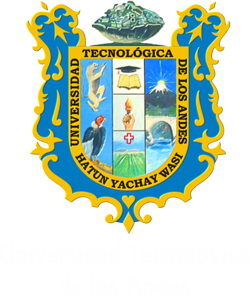

# UNIVERSIDAD TECNOLÓGICA DE LOS ANDES

## CARRERA PROFESIONAL DE INGENIERÍA DE SISTEMAS E INFORMATICA

### CURSO: Administración de Base de Datos

---

**TEMA:** Copia de seguridad o respaldo

**DOCENTE:** Ramiro Mora Jiménez

**ALUMNO:** Beder Danilo Casa Condori

---

**Cusco – Perú**  
**2024**
